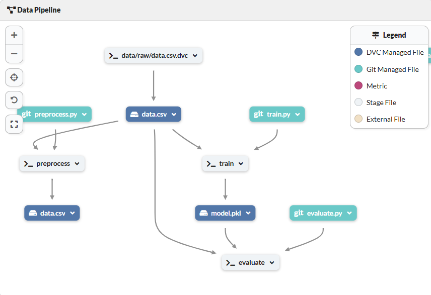

### 🌟 End-to-end Machine Learning Pipeline with DVC, DagsHub, and MLflow

This repository demonstrates how to build a reproducible and collaborative machine learning pipeline using DVC (Data Version Control) for versioning, DagsHub for seamless integration and collaboration, and MLflow for experiment tracking.

We use the Pima Indians Diabetes Dataset, a classic dataset that predicts the likelihood of diabetes in patients based on diagnostic attributes.


### Project Structure 


├── data/  
│   ├── raw/                # Raw dataset (data/raw/data.csv)  
│   ├── processed/          # Preprocessed dataset (data/processed/data.csv)  
├── models/                 # Trained models (e.g., models/random_forest.pkl)  
├── src/                    # Source code  
│   ├── preprocess.py       # Data preprocessing script  
│   ├── train.py            # Model training script  
│   ├── evaluate.py         # Model evaluation script  
├── dvc.yaml                # DVC pipeline definition  
├── requirements.txt        # Python dependencies  
└── README.md               # Project documentation  


###  Dataset
The Pima Indians Diabetes Dataset contains medical data for 768 women of Pima Indian heritage, including diagnostic variables such as glucose level, blood pressure, and BMI, alongside a binary outcome indicating diabetes presence. [Dataset Source: Kaggle - Pima Indians Diabetes Dataset](https://www.kaggle.com/uciml/pima-indians-diabetes-database)


### Pipeline Overview
This project includes three primary stages:

1️⃣ **Preprocessing**
Script: `src/preprocess.py`
Reads raw data (data/raw/data.csv) and performs preprocessing tasks like column renaming and normalization.
Outputs: `data/processed/data.csv`.

2️⃣ **Training**
Script: `src/train.py`
Trains a Random Forest Classifier on the preprocessed data.
Logs hyperparameters and metrics using MLflow.
Saves the trained model as `models/model.pkl`.

3️⃣ **Evaluation**
Script: `src/evaluate.py`
Evaluates the trained model on test data, logging performance metrics like accuracy to MLflow for tracking and comparison.

### Key Features
1. **Data Version Control with DVC**
- Tracks datasets, models, and pipeline stages, ensuring reproducibility.
- Automatically re-executes pipeline stages when dependencies (data, code, or parameters) 
  change.
- Supports remote storage with DagsHub for large datasets and models.
  
2. **Collaboration with DagsHub**
- Centralized hub for datasets, code, and model artifacts.
- Seamlessly integrates with DVC and MLflow, enabling full visibility into data versions and 
  experiments.
  
3. **Experiment Tracking with MLflow**
- Logs hyperparameters, metrics, and models.
- Compares multiple experiment runs for better model optimization

Here, is ML pipeline for this task from DagsHub 


### For Adding Stages
```
dvc stage add -n preprocess \
    -p preprocess.input,preprocess.output \
    -d src/preprocess.py -d data/raw/data.csv \
    -o data/processed/data.csv \
    python src/preprocess.py
```	
```	
dvc stage add -n train \
    -p train.data,train.model,train.random_state,train.n_estimators,train.max_depth \
    -d src/train.py -d data/raw/data.csv \
    -o models/model.pkl \
    python src/train.py
```
```	
dvc stage add -n evaluate \
    -d src/evaluate.py -d models/model.pkl -d data/raw/data.csv \
    python src/evaluate.py
```

### Quickstart
1. **Clone the Repository**
   ```
   git clone https://github.com/your-username/ml-pipeline-dvc-mlflow  
   cd ml-pipeline-dvc-mlflow
   ```
2. **Install Dependencies**
   ```
   pip install -r requirements.txt  
   ```
3. **Set Up and Connect to DagsHub**
   ```
   dvc remote add -d dagshub_remote <dagshub-repo-url>  
   dvc push
   ```
4. **Run the Pipeline**
   ```
   dvc repro
   ```
### Goals of the Project
 * **Reproducibility**: Ensure that models, data, and code produce consistent results.
 * **Experimentation**: Track and compare model performance across multiple runs.
 * **Collaboration**: Enable seamless teamwork with DagsHub and DVC.

